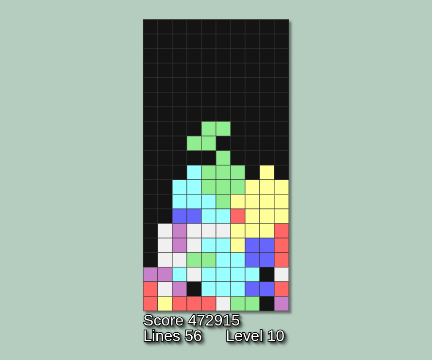

# TETRIS - JavaScript + p5.js

## Sobre el proyecto

- Versión del clásico juego desarrollada en **JavaScript**, realizada con fines de aprendizaje, práctica y diversión.

- Se utiliza **[p5.js](https://p5js.org/es/)** para el renderizado gráfico y la gestión del canvas, permitiendo dibujar las piezas, detectar colisiones y responder a las acciones del jugador en tiempo real.

### Controles por teclado:

- ⬆️ o **W**: Rotar la pieza

- ⬅️ o **A**: Mover pieza a la izquierda

- ➡️ o **D**: Mover pieza a la derecha

- ⬇️ o **S**: Mover pieza hacia abajo

- **Barra espaciadora**: Caída instantánea

- **P**: Pausar o reanudar el juego

- **N**: Reiniciar el juego

## [👉 Hacé clic acá para jugar!](https://tetris-javascript-flame.vercel.app/)

📌 **Este proyecto está activo y en constante evolución.** Si tienes ideas, sugerencias o quieres contribuir, tus aportes serán bienvenidos!

---

Creado por [Joan Simonutti](https://www.linkedin.com/in/joansimonutti/) | 2025

