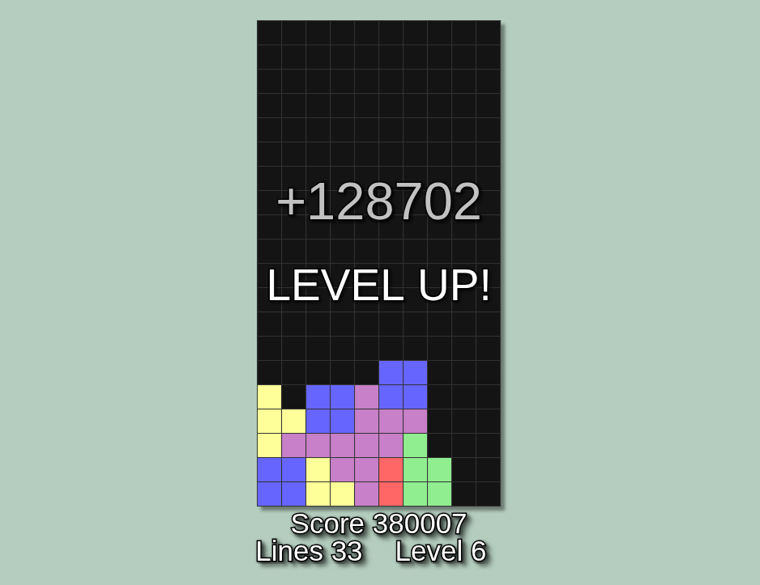

# Tetris - Versión JavaScript 🕹️

## Sobre el proyecto

- Versión del clásico juego Tetris desarrollada en **JavaScript**.
- Se integra la biblioteca gráfica **[p5.js](https://p5js.org/es/)** para gestionar el canvas, el renderizado y la interacción en tiempo real.
- El juego cuenta con una lógica completa, arquitectura modular y está diseñado para ser escalable.

### Controles por teclado

- ← o A: Mover pieza a la izquierda

- → o D: Mover pieza a la derecha

- ↓ o S: Mover pieza hacia abajo

- ↑ o W: Rotar la pieza

- Barra espaciadora: Caída instantánea

- P: Pausar o reanudar el juego

- N: Reiniciar el juego

## [👉 Hacé clic acá para jugar!](https://tetris-javascript-flame.vercel.app/)

Creado por [Joan Simonutti](https://www.linkedin.com/in/joansimonutti/) | 2025

